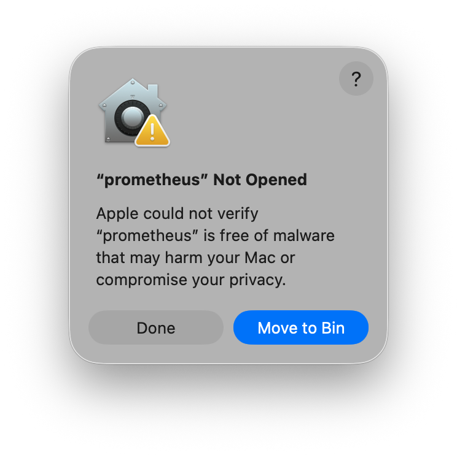
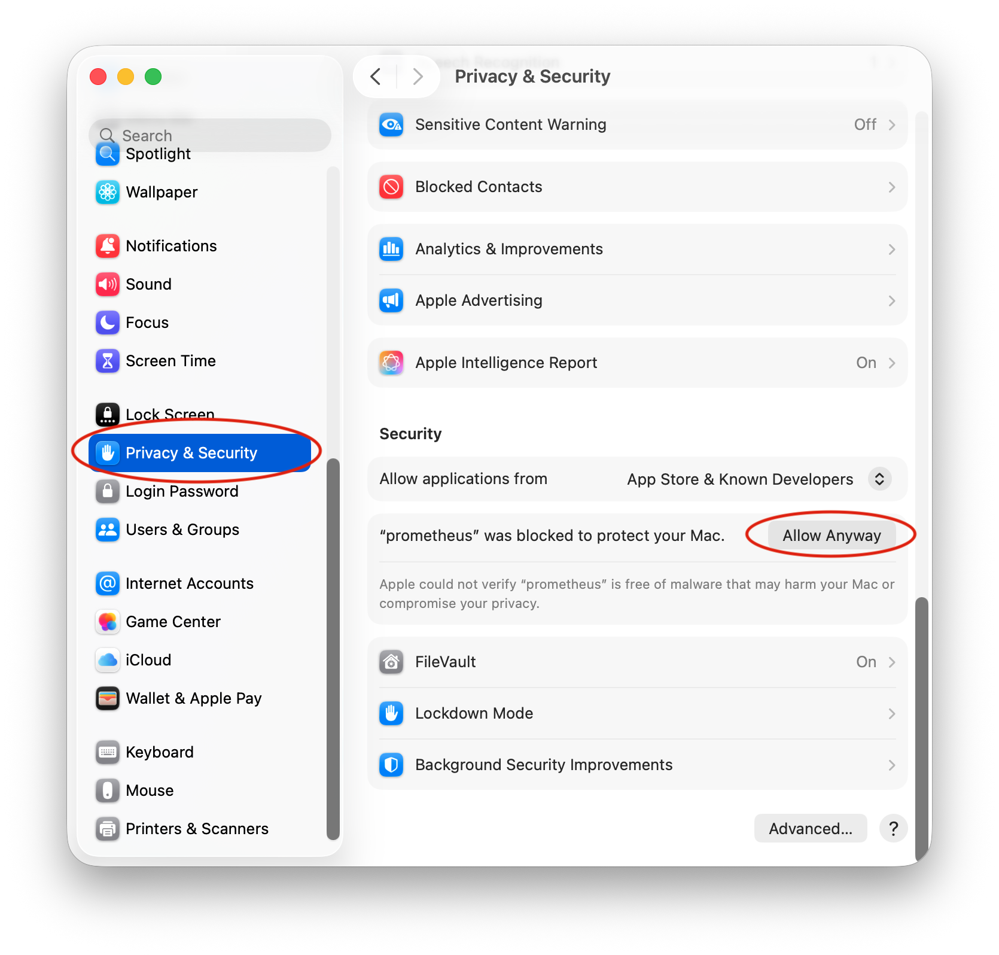
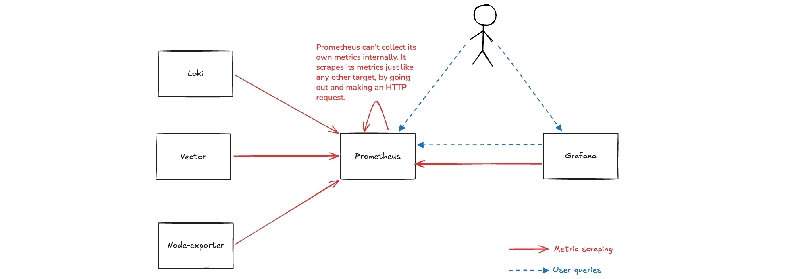
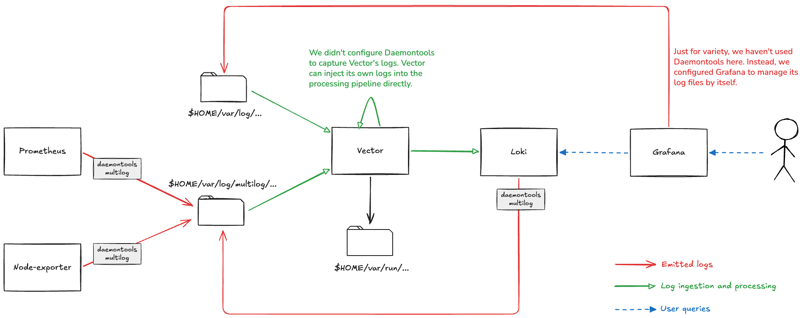
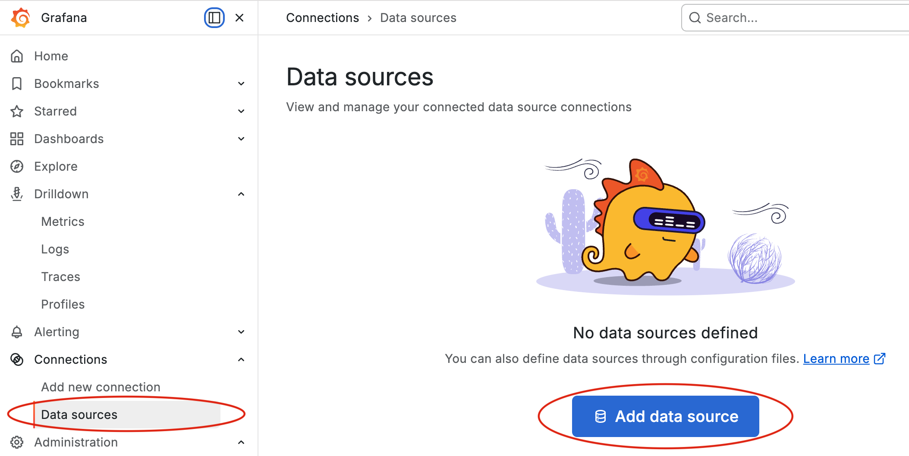
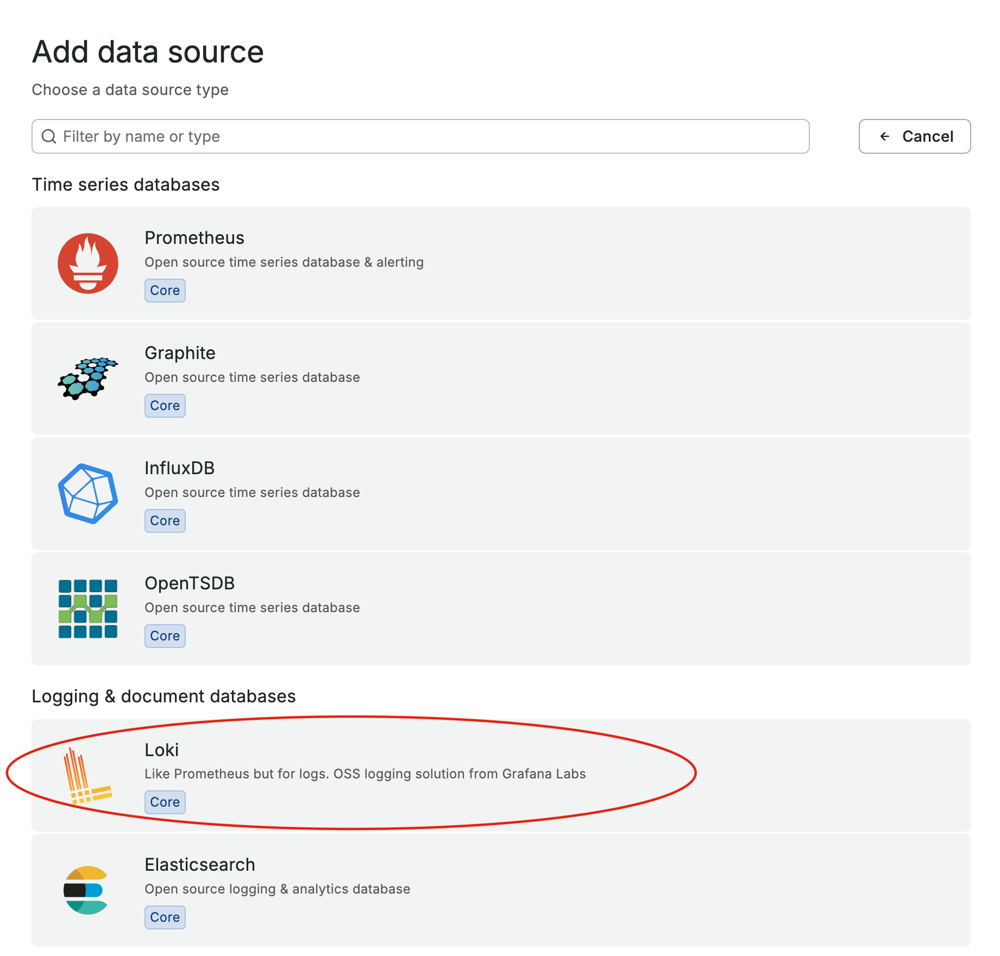
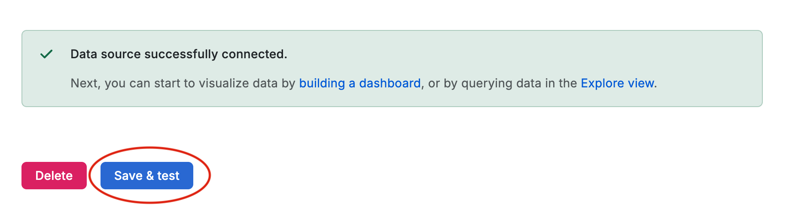
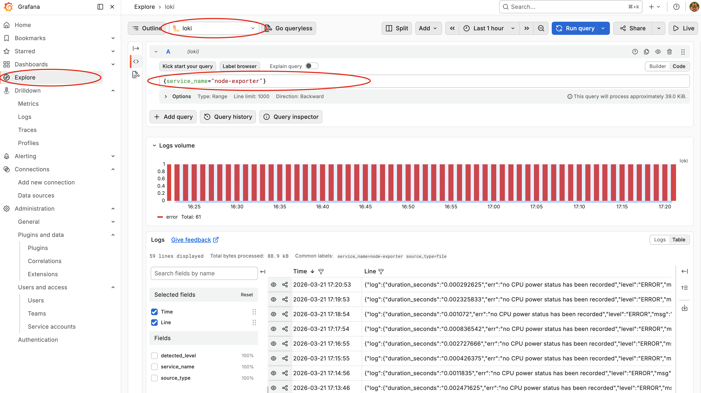
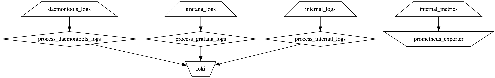

# SRE Lab

A local testing environment for technologies of interest to a Site Reliability Engineer.

## What's covered?

At the moment this lab covers just basic observably, specifically metrics and logs. It consists of:

1. [Prometheus](https://prometheus.io/)
2. [Loki](https://grafana.com/oss/loki)
3. [Grafana](https://grafana.com/oss/grafana/)
4. [Vector](https://vector.dev/)
5. [Prometheus node-exporter](https://github.com/prometheus/node_exporter)

## Installation

Everything is launched and managed by Daniel Bernstein's [daemontools](https://cr.yp.to/daemontools.html), a classic
process supervisor for UNIX operating systems. It is ultra simple and allows us to launch the entire lab with a single
command. You can install it with [Homebrew](https://brew.sh/):

```bash
brew install daemontools
```

You also need to install all of the lab components. While some of them are available on Homebrew, we generally prefer to
install this part of the lab directly. There are some shell scripts in the [`./install-scripts`](./install-scripts)
directory to download and install each component.

Prometheus, node-exporter, Loki, and Vector are single binaries. As long as they are in your `$PATH`, the lab will work.
The installation scripts copy the binaries to `$HOME/bin`, so make sure that directory is in your `$PATH`. Grafana is a
bit more elaborate. The lab expects it to be found in `$HOME/opt/grafana`.

If you decide to download release assets from GitHub by clicking in your browser (e.g. for [prometheus][prom-releases])
and then uncompressing `zip`/`tag.gz` files manually in macOS Finder, then be aware that the default (and very sinsible)
macOS security setting only allows signed binaries to be executed (i.e. App Store and known developers). You will get an
error like this:

[prom-releases]: https://github.com/prometheus/prometheus/releases

<p align="center"></p>

Normally, you can allow the last attempted app by going to **System Settings > Privacy & Security**:

<p align="center"></p>

However, if you have additional security tools on your machine then this might get cumbersome. Luckily, you don't need
any of this. The protection that prevents the program from running is just an extended file attribute
(`com.apple.quarantine`):

```bash
xattr <file>
```

You can easily remove it with the `-d` option:

```bash
xattr -d com.apple.quarantine <file>
```

> [!CAUTION]
> Apple's warning mechanism is just that, a warning. The binaries are only checked for a signature. No actual malware
> scanning is done. Any binaries downloaded through the terminal (e.g. via `curl` or `wget`) or built from sources
> will bypass the warning. And as shown above, it is easy to circumvent it with a simple `xattr` command. Therefore,
> make sure you trust the source of whatever files you download. The warning is there for a reason.

## Prerequisites

The only prerequisite is to create the needed directories, which you can do with the included script:

```bash
setup.sh
```

## Running

The entire lab can be started with a single invocation of daemontools' `svscan` command on the `services` directory:

```bash
svscan services
```

## Design philosophy

Unlike other lab environments (e.g. the [OpenTelemetry demo](https://opentelemetry.io/ecosystem/demo/)), we do not use
Docker containers, Docker Compose, or Kubernetes tools like Kind or Minikube. While containers make things more
portable and more secure, they also add complexity. The purpose of this lab is learning. Therefore, one of its
objectives is to strip away unnecessary complexity, reduce cognitive load, and focus on the technologies at hand. Hence
the choice of daemontools over containers (and over more complex process supervisors like s6 or macOS launchd).

At the moment, all components listen on a TCP port, and all bind to address `0.0.0.0` (i.e. they listen on all network
interfaces). This is perfectly okay for our purposes and keeps with our philosophy of simplicity.[^2]

[^2]: In the future, we will expand this lab with more sophisticated setups and add more components, including multiple
instances of the same component, to experiment with things like replication and sharding. Even in such scenarios, the
usage of ports will get us far. However, when we reach a point where it becomes a hindrance, we can start using
multiple IP addresses. Since everything is running locally, a good choice is to bind extra IP addresses to the loopback
interface (`lo0` on my mac). It can be done on macOS with, for example, `ifconfig lo0 alias 127.0.0.2 up` (requires
`sudo`). IP aliases are discarded when the machine reboots but can also be removed with `ifconfig lo0 -alias 127.0.0.2`.

## Architecture

### What files are you putting on my computer and where?

Besides the suggested installation locations at `$HOME/bin` and `$HOME/opt` mentioned earlier, all the components are
configured such that the only affected path on your disk is `$HOME/var`. We've laid out its contents to match the
traditional UNIX convention for directories under `/var`. We've chosen to put everything under the home directory
because: (1) we will be running everything as our own user, and (2) it makes life easier by avoiding the need to
`sudo`.

Affected directories:

- `$HOME/var/lib/` - data files for persistent services, e.g. Prometheus's TSDB, Grafana's SQLite database.
- `$HOME/var/run/` - ephemeral runtime data such as PID files, lock files, seek positions within log files, etc.
- `$HOME/var/log/` - logs.
- `$HOME/var/log/multilog/` - logs captured by daemontool from standard output of managed services.
- `$HOME/bin/` - installation location for single binaries and/or symlinks.
- `$HOME/opt/` - installation location for larger packages.

### How daemontools works (briefly)

If you take a look at the [`./services`](./services) directory, you will find that it is quite simple. daemontools
expects a sub-directory for each service it will manage. Each of these needs to have an executable file named `run`.
When you start `svscan`, it runs a supervised tree where daemontools `supervise` is launched per service directory,
which in turn runs the service's `run` script.[^3]

[^3]: You'll notice that the final line in each `run` script uses `exec`. This is important and fundamental to how UNIX
process supervisors work. daemontools' `supervise` can only manage its direct child process, not grandchildren. When
this lab expands to include more technologies, it will be important to make sure we disable any daemonisation options
on any software that supports it. An example is to launch Redis with `redis-server --daemonize no`. Another example is
to start PostgreSQL with the `postgres` binary and not with `pg_ctl`. Yet another is the `daemon off` setting in
NGINX's config file.

An optional `log` sub-directory with its own `run` command can be added under each service. The command invokes
daemontools' `multilog`, which captures the service's standard output, sends it to a log file, and rotates the log file
based on size and/or age.

The process tree will look something like this (you can generate one with `pstree $(pgrep svscan)`):

```
─┬─ svscan services
 ├─┬─ supervise loki
 │ └─── loki --config.expand-env=true --config.file loki.yaml
 ├─┬─ supervise log
 │ └─── multilog /Users/YOURNAME/var/log/multilog/loki
 ├─┬─ supervise grafana
 │ └─── bin/grafana server --config conf/sre-lab.ini
 ├─┬─ supervise prometheus
 │ └─── prometheus --config.file prometheus.yaml --web.listen-address=0.0.0.0:9090 --storage.tsdb.path /Users/YOURNAME/var/lib/prometheus
 ├─┬─ supervise log
 │ └─── multilog /Users/YOURNAME/var/log/multilog/prometheus
 ├─┬─ supervise vector
 │ └─── vector -c vector.yaml
 ├─┬─ supervise node-exporter
 │ └─── node_exporter
 └─┬─ supervise log
   └─── multilog /Users/YOURNAME/var/log/multilog/node-exporter
```

Note that daemontools will create a `supervise` directory under each service subdirectory within `./services` to track
runtime state. These directories are excluded in [`.gitignore`](./.gitignore).

### Technologies

Pictorially, the programs that will be running on your machine are:

<p align="center"></p>

Three of these are persistent systems that have a database of some kind.

<p align="center"></p>

### Metrics

Metrics are collected/pulled ("scraped" in the official lingo) by Prometheus from all components. They all expose their
metrics in Prometheus format (a.k.a. Open Metrics) on the `/metrics` path. You can also fetch them yourself with `curl`
or in your browser.

- http://localhost:9090/metrics (Prometheus)
- http://localhost:9100/metrics (Node-exporter)
- http://localhost:3000/metrics (Grafana)
- http://localhost:3100/metrics (Loki)
- http://localhost:9598/metrics (Vector)

The targets are all declared in Prometheus' config file [`prometheus.yaml`](./services/prometheus/prometheus.yaml)

<p align="center"></p>

The diagram shows Prometheus scraping its own metrics. Prometheus can't collect its metrics internally and must instead
scrape them like any other target, by going out and making an HTTP request.

### Logging

We use daemontools' `multilog` to capture standard output from 3 of the 5 components. For the sake of variety, we've
configured Grafana to manage its own log files instead of using multilog.

Most of the components are configured to log in _logfmt_, a simple key=value format. The only exception is Loki. We've
configured it to emit JSON logs, again for the sake of variety.

Some components output to both standard output (stdout) and standard error (stderr), so you will see some cases in `run`
scripts where we redirect stderr to stdout (`2>&1`). On the other hand, when we run commands to validate a
configuration file before starting the component, we redirect that output to stderr (`>&2`) so that it is helpfully
displayed in the terminal window where `svscan` runs.

[internal_logs]: https://vector.dev/docs/reference/configuration/sources/internal_logs/

<p align="center"><p>

The diagram shows Vector collecting its own logs. Unlike the case with Prometheus and its own metrics, Vector can
ingest its own logs using the [`internal_logs` source][internal_logs], so there is no need to push its logs to a
file.

## Experimenting

### Inspect some metrics in Prometheus

Open up the Prometheus UI at http://localhost:9090. Here are some queries to try.

The most basic metric is the `up` metric. The results should match what's in the targets section
http://localhost:9090/targets

```
up
```

Percent of available space on your hard disk. This should match the output of `df -h`.

```
node_filesystem_avail_bytes{mountpoint="/"} / node_filesystem_size_bytes
```

Total CPU seconds per second. If you switch to graph view and the select stacked view, the total should equal the number
CPU cores in your machine.

```
sum by(mode)(rate(node_cpu_seconds_total[5m]))
```

> [!NOTE]
> This query illustrates three key rules in writing PromQL:
>
> 1. Counter metrics are meaningless on their own. You need to take a `rate` or similar function.
>
> 2. Always take a sum of rates, **never** a rate of sums, i.e.
> 
>    `rate(sum(...))` ❌
>
>    `sum(rate(...))` ✅
>
> 3. `rate` produces a rate per second. The `[5m]` interval is used to calculate the average, but the result is always
>    per second.

Your laptop's battery health status (if you are using a laptop).

```
node_power_supply_battery_health == 1
```

Number of time-series in the head block. This should match the value in the TSDB status section http://localhost:9090/tsdb-status.

```
prometheus_tsdb_head_series
```

Number of sample points collected per second.

```
sum(rate(prometheus_tsdb_head_samples_appended_total[1m]))
```

Vector's disk buffers. Note that Vector doesn't export its metrics by default. We declared a `prometheus_exporter`
[sink][v-prom-exporter] in our config.

```
vector_buffer_byte_size{buffer_type="disk"}
```

[v-prom-exporter]: https://vector.dev/docs/reference/configuration/sinks/prometheus_exporter

Node-exporter also has a UI at http://localhost:9100, but it isn't terribly useful.

### Log into Grafana and add a data source for Loki

Grafana is at http://localhost:3000. You need to login with a username and password. The default is admin/admin. You can
skip resetting the password.

Add a data source for Loki (and Prometheus too if you want).

<p align="center"></p>

Select the Loki source

<p align="center"></p>

Enter the address and port

<p align="center"></p>

Click "Test & Save"

<p align="center"></p>

### Run some Loki queries

Go to the Explore page, select Loki as the data source, and run a query.

<p align="center"></p>

Here are some queries to try:

```
{service_name="node-exporter"} |= "CPU power"
```

```
{service_name="loki"} | detected_level!="info"
```

```
{service_name="vector"} | json | log_vector_component_type=`file`
```

```
{service_name="node-exporter"} | json | log_err =~ ".+"
```

Loki's query language is an unusual hybrid that consists of three types of expressions. The first is a PromQL-like label
selector. In our setup we are only setting two labels: `service_name` and `source_type` (set in Vector). The number of
such labels in Loki is meant to be small.

You can optionally pipe the result to a string matching expression on the log line, e.g. `|= "hello"` means: search for
log lines that contain the string "hello".

You can also match on a set of pre-populated, non-label fields. Currently the only one is `detected_level`. However, if
the log line is in a structured format then you can also parse it by piping to the `json` built-in function. Unlike
other log stores that parse logs at indexing time, Loki only stores a restricted number of Prometheus-style labels,
while full log parsing (if desired) is done at query time. Once parsed, you can write a match on individual fields.
Note that nested fields are flattened with an underscore separator `_`, so the error message in a log string like
`{"log":{"error":"..."}}`, after parsing, is available in a field named `log_error`.

Backticks `` ` `` are an alternative quoting mechanism for so-called _raw strings_. They don't support escape sequences
(e.g. `\n`).

### Experiment with Vector

The [`vector.yaml`](./services/vector/vector.yaml) file contains the processing pipeline with
[sources, transforms, and sinks](https://vector.dev/components/). The transformation logic is all coded in Vector's
[VRL](https://vector.dev/docs/reference/vrl/) (Vector Remap Language).

VRL has an interactive REPL that you can play with:

```bash
vector vrl
```

One of the things we do in Vector is parsing log messages, first as JSON, and then, if unsuccessful, as logfmt. For the
sake of variety, we do this in two different ways. One is via an `if`/`else` statement and handling errors explicitly
using the so-called _fallible_ versions of functions (i.e. without a `!` suffix):[^4]

[^4]: The `accept_standalone_key` option of the `parse_key_value` function is set to `false` because we ran into a bug
where one of the components (Grafana) adds a newline at odd locations in its JSON logs. Such lines, on their own,
aren't valid JSON, so the parsing logic falls through and tries logfmt. If `accept_standalone_key` were omitted or set
to `true`, then the fragment of JSON would be recognized as a field name without a value, which definitely isn't
sensible.

```rust
if (parsed, err = parse_json(.message); err == null && is_object(parsed)) {
  .log = object!(parsed)
}  else if (parsed, err = parse_key_value(.message, accept_standalone_key: false); err == null) {
  .log = parsed
} else {
  .raw_log = .message
}
```

The other approach is more compact and uses the type coercion operator `??` and the object merge operator `|=`:

```rust
. |= { "log": object(parse_json!(.message)) } ??
     { "log": parse_key_value(.message, accept_standalone_key: false) } ??
     { "raw_log": .message }
```

As the code shows, parsed and unparsed results are placed under the `log` and `raw_log` fields, respectively. Afterwards
we delete the original `.message` field:

```rust
del(.message)
```

Note that we haven't done any processing to extract the real timestamp from structured logs. We are using the ingestion
time as the log timestamp, which is **not** the correct approach.

### Visualize the Vector pipeline

You can display the Vector pipeline in the form of a diagram by running:

```bash
vector graph -c services/vector/vector.yaml
```

The command will output a diagram spec in the [DOT language](https://graphviz.org/doc/info/lang.html). You can then use
an online Graphviz site to render the spec.



### Manage your services

daemontools has a number of commands. Run these from within the `services` directory:

```bash
svc -u <service> # Starts a service
svc -d <service> # Shuts down a service
svc -h <service> # Sends a SIGHUP. Many programs reload their config upon receiving this signal.
svstat <service> [<service> ...] # Prints the status of one or more services
svok <service> # Exits with code 0 if the service is running. Useful for scripts.
```

`svc` can send several other UNIX signals. See the [docs](https://cr.yp.to/daemontools/svc.html).

## Stop the lab

daemontools is designed to run forever, so there is no built-in way to stop everything in one go. You would have to
`svc -d` each service (and its log sub-service). However, pressing **Ctrl-C** in the terminal window where `svscan` is
running will do the trick.[^5]

[^5]: Ctrl-C sends a SIGINT to the _entire_ process group at the same time. While this means that the process tree won't
exit in sequence from parent to child, SIGINT is still meant to be a graceful shutdown signal. On my system, most
components exit more or less immediately. The only exception is Vector. Its process gets orphaned and re-parented to
PID 1 (which is the normal UNIX behavior). It then waits for a grace period before shutting down. We've set the grace
period to 5 seconds (down from its default of 60) using the `--graceful-shutdown-limit-secs` option in the `run`
script.

## Reset the entire lab

It is perfectly fine to rerun `svscan` after stopping. However, if you want to clear everything and start from scratch,
including all runtime data as well as Prometheus' and Loki's databases, then use the [`reset.sh`](./reset.sh) script.
